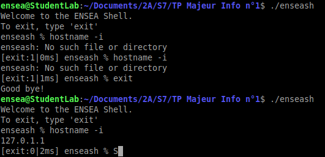

**TP Majeure Info N1 CHENDEA BRIAND**

__Question 1:__
Dans cette question, nous devions créer une shell ensea, le but était simplement d'afficher le message d'acceuil et de rentrer dans notre invite de commande personnalisée.  
Voici ce que l'on voit lorsque l'on execute le code contenu dans le fichier "enseash.c" :  
On voit bien que lorsque l'on se place dans le bon répertoire et que l'on exécute ./enseash, on rentre dans notre micro-shell  
  
  
  
Le code associé à cette fonction se trouve dans le dossier Q1  
  
__Question 2:__  
Nous avions déjà crée une micro shell permettant d'executer des fonctions simples (si elles sont implémentées dans l'environnement de travail.  
Il fallait simplement importer 'fortune' et 'date' pour faire des tests simples:  
*sudo apt-get install fortune*  
*sudo apt-get install date*  

 
  
Le code associé à cette fonction se trouve aussi dans le dossier Q1 comme nous n'avons rien changé

__Question 3:__  
Nous avions déjà, lors de la question 1, implémenté le 'exit', on peut le voir sur la première capture d'écran, cependant, il fallait rajouter le code permettant d'implémenter le fait que ctrl + d permette de sortir aussi de notre micro-shell.  

Cette partie du code est écrite dans le dossier Q2.

__Question 4:__  
La partie de code ajoutée pour cette question est dans le dossier Q4. 
L'objectif est que notre invite de commande renvoie une expression différente en fonction des appels, en particulier qu'elle puisse signaler les erreurs de types 'Segmentation False' (pour laquelle elle renverra un 'sign'). Lorsque le preogramme appelé ne compile pas, il n'est pas reconnue par enseash qui renvoie un 'exit: 1'. Lorsqu'il compile et s'execute sans problème, elle renvoie un 'exit: 0', cependant, en cas de return dans la fonction, elle renvoie bien sûr la valeur appelée par le return.  
On regarde ce qui s'affiche pour une fonction (sans return) écrite de 3 manières:  
1) Non définie ou qui ne compile pas.  
2) Qui compile et s'execute sans problème
  
  
  
3) Qui comporte un segmentation false  
  
  
  
Et voici une capture de cmd lors de 3 appels successifs de myprogramm.c :

  

__Question5:__  
Dans cette question, on reprends la partie de code écrite dans la question 4, en rajoutant toutefois un timer permettant de mesurer le temps d'exécution de l'appel. On utilise pour cela un clock_gettime.  
Pour être sûrs que notre code fonctionne bien, on ajoute un sleep de 2 secondes à notre fonction test. Cela permettra de voir si le temps affiché est fiable, normalement il devrait être de 2000 + t ms avec t de l'odre de la miliseconde ou des 10 milisecondes.  

  
  
On peut voir sur l'image ci-dessous que l'appel fonctionne bien, le temps s'affichant étant de 2002 ms.  

  
  
__Question6:__  
Dans cette question, on rajoute la possibilité d'appeller des fonctions possédant des arguments dans notre enseash. Pour cela on rajoute les lignes de codes visibles dans le dossier Q6. On utilise un strtok qui permet de séquencer la commande afin d'en extraire une première chaîne de caractère (qui est la commande en elle-même) puis les autres (qui sont les arguments).  
Voici ce que l'on peut observer dans le cmd avant et après compilation du nouveau code :  

  

__Question7:__  
Avant de rajouter le code de cette question, nous avons constaté que notre code précedent ne permet pas de prendre en compte plus d'un argument pour un appel, nous modifions donc tout d'abord notre code afin de prendre en compte plusieurs arguments. Nous créons pour cela un tableau pour les arguments (de taille 50 par sécurité).IL faut créer une boucle while afin de mettre tous les arguments dans un même tableau de pointeurs de chaînes de caractères. Ensuite, pour appeler les arguments, on utilise cette fois un execvp afin de faire appel au tableau.  

  

Nous n'avons pas réussi à aller plus loin.
  
